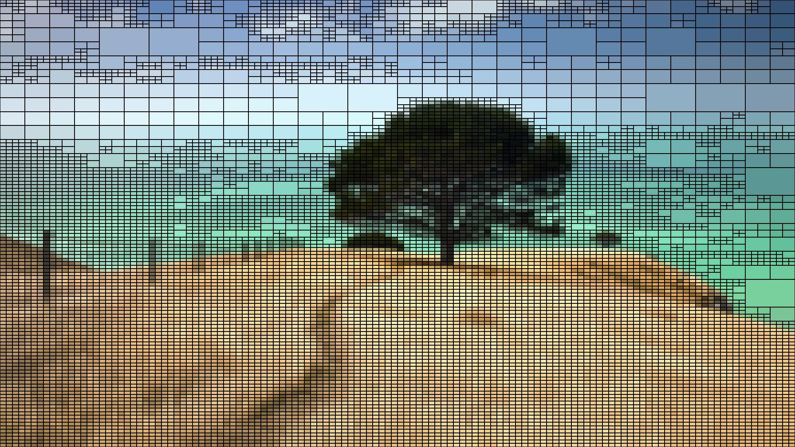

# QuadTree-Image-Compressor
Compress Images using Quad Trees Efficiently

add your Image path in  path = "file_path" variable and see the below images save in the same directory

<h2>Original Image<h2>  

</img>

<h2>Compressed Image<h2>  

</img>

<h2>Quad Tree Render<h2>  

</img>

<h2>Quad Tree Structure<h2>  

</img>

